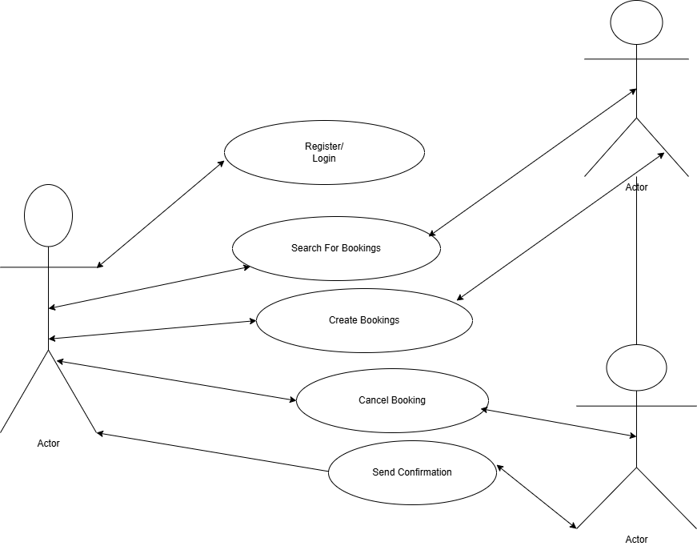

# requirement-analysis
This repository serves as a resource hub for understanding and documenting requirement analysis in software development. Requirement analysis is the foundational phase of the software development lifecycle, focusing on gathering, analyzing, and defining what the software must accomplish. 
# Requirement Analysis in Software Development

## Introduction

This repository is dedicated to exploring the process of requirement analysis in software development. Requirement analysis is a critical early stage in the software development lifecycle where the needs and expectations of users and stakeholders are identified, documented, and validated.

## Purpose

The purpose of this repository is to:

- Provide foundational knowledge on requirement analysis
- Share practical examples and templates
- Document common challenges and solutions
- Serve as a reference for students, developers, and project managers

## Topics Covered

- Types of Requirements (Functional & Non-functional)
- Requirement Gathering Techniques
- Use Case Development
- User Stories and Acceptance Criteria
- Requirement Validation and Verification
- Tools used in Requirement Analysis

## How to Use This Repository

Browse through the folders and markdown files to explore various aspects of requirement analysis. Contributions are welcome—feel free to fork the repo, make updates, and create pull requests.

## License

This project is licensed under the MIT License.

## What is Requirement Analysis?

Requirement Analysis is the process of identifying, documenting, and managing the needs and expectations of stakeholders for a new or modified software system. It is a foundational phase in the Software Development Life Cycle (SDLC) that ensures the development team clearly understands what the software must do before any design or coding begins.

### Why is Requirement Analysis Important?

Requirement Analysis plays a crucial role in the success of any software project. Here's why:

- **Clarifies Project Scope**: It helps define the boundaries of the project, avoiding scope creep and ensuring  everyone is aligned on what is being built.
- **Improves Communication**: It serves as a communication bridge between stakeholders, project managers, business analysts, and developers.
- **Reduces Risk**: By identifying requirements early, the chances of costly rework and project failure are significantly reduced.
- **Guides Design & Development**: Clearly defined requirements serve as a blueprint for system architecture, interface design, and code development.
- **Enables Better Testing**: Well-documented requirements provide a basis for creating effective test cases, ensuring that the final product meets user expectations.

### Key Activities in Requirement Analysis

1. **Requirement Elicitation** – Gathering information from stakeholders through interviews, questionnaires, observations, etc.
2. **Requirement Documentation** – Creating clear and structured documents that capture all identified requirements.
3. **Requirement Validation** – Ensuring that the documented requirements accurately represent stakeholder needs and are feasible.
4. **Requirement Management** – Tracking and managing changes to requirements throughout the project lifecycle.

In summary, Requirement Analysis is not just about gathering information; it’s about understanding the problem space, aligning expectations, and laying a solid foundation for successful software development.

## Key Activities in Requirement Analysis

Requirement Analysis involves several structured activities that help ensure software requirements are well-understood, clearly defined, and properly documented. Below are the five key activities involved:

- **Requirement Gathering**  
  This involves collecting high-level information about what the stakeholders need from the system. It includes identifying all relevant stakeholders and collecting initial input through meetings, surveys, and research.

- **Requirement Elicitation**  
  Elicitation goes deeper than gathering. It involves actively engaging stakeholders using techniques such as interviews, brainstorming, workshops, use case analysis, and observation to uncover detailed and often hidden needs.

- **Requirement Documentation**  
  Once requirements are gathered and elicited, they must be documented in a clear, consistent, and understandable format. This may include Software Requirement Specifications (SRS), user stories, or use case diagrams.

- **Requirement Analysis and Modeling**  
  This step involves analyzing the collected requirements to resolve conflicts, identify priorities, and ensure feasibility. It may also include modeling techniques like data flow diagrams (DFDs), entity-relationship diagrams (ERDs), or UML to visualize and clarify system behavior.

- **Requirement Validation**  
  Validation ensures that the documented requirements accurately reflect stakeholder needs and are complete, consistent, and testable. Techniques include reviews, walkthroughs, and prototyping to confirm that everyone agrees on what is to be built.

Each of these activities plays a vital role in ensuring the success of a software project by reducing ambiguities and aligning stakeholder expectations.

## Types of Requirements

In software development, requirements are generally categorized into two main types: **Functional** and **Non-functional** requirements. Both are essential to building a system that meets user expectations and operates effectively.

### Functional Requirements

**Definition:**  
Functional requirements describe what the system should do — the specific behaviors, functions, and interactions it must support. These are directly related to user goals and system functionality.

**Examples (Booking Management Project):**
- Users should be able to **create an account** and **log in securely**.
- The system must allow users to **search for available booking slots** based on date and time.
- Admins should be able to **approve, modify, or cancel bookings**.
- The system must **send confirmation emails** to users after a booking is successfully made.
- Users should be able to **view, update, or cancel their own bookings** through a dashboard.

### Non-functional Requirements

**Definition:**  
Non-functional requirements define how the system performs its functions. They cover attributes such as performance, usability, security, reliability, and scalability. These do not describe specific behaviors but instead focus on  on system qualities.

**Examples (Booking Management Project):**
- The system should load the booking dashboard in **under 3 seconds**.
- User data must be **encrypted in transit and at rest** to ensure security.
- The platform should support **up to 10,000 concurrent users** without performance degradation.
- The user interface must be **responsive and mobile-friendly**.
- The system must have **99.9% uptime availability** over a 12-month period.

Both types of requirements are crucial for delivering a successful product. Functional requirements ensure the system meets user expectations, while non-functional requirements ensure it performs reliably under various conditions.

## Use Case Diagrams

### What Are Use Case Diagrams?

Use Case Diagrams are a type of Unified Modeling Language (UML) diagram that visually represent the functional requirements of a system from the user's perspective. They show the various interactions between **actors** (users or external systems) and **use cases** (functions or services provided by the system).

### Benefits of Use Case Diagrams

- Clearly communicate system functionality to stakeholders.
- Help identify and define user roles and system boundaries.
- Serve as a foundation for writing detailed requirements and test cases.
- Provide a visual overview of how users interact with the system.

### Use Case Diagram for the Booking Management System

Below is the use case diagram representing the main actors and their interactions with the system:

## Acceptance Criteria

### What is Acceptance Criteria?

Acceptance Criteria are the predefined conditions or statements that a software product must satisfy to be accepted by a user, customer, or other stakeholders. They define **"done"** for a particular feature and are typically written in plain, clear language to ensure a mutual understanding of expectations.

### Importance of Acceptance Criteria in Requirement Analysis

- ✅ **Clarity**: They eliminate ambiguity by clearly outlining what needs to be implemented.
- 📋 **Alignment**: Keep developers, testers, and stakeholders on the same page.
- 🧪 **Testability**: Serve as a basis for writing test cases and verifying that the feature works as expected.
- 🚫 **Scope Control**: Help prevent scope creep by limiting the implementation to defined behavior.

### Example: Acceptance Criteria for the Checkout Feature in the Booking Management System

**Feature:** Checkout

**As a** user,  
**I want** to securely complete my booking and make payment,  
**So that** I can confirm my reservation and receive a confirmation.

#### Acceptance Criteria:

- The user must be logged in to access the checkout page.
- The checkout page should display a summary of the selected booking, including date, time, service, and cost.
- The system must allow the user to choose a payment method (e.g., card, bank transfer).
- The user should receive real-time validation for required fields (e.g., billing info, payment details).
- Once payment is successful, the booking should be marked as “Confirmed” in the system.
- The system must send a confirmation email to the user within 2 minutes of successful payment.
- If payment fails, an error message must be displayed and the booking must remain in “Pending” status.

---

These criteria ensure that the **Checkout** feature works as expected, meets user needs, and is testable before being marked as complete.

